# ファイル構成とインクルード依存関係・データ共有設計

`26th_Underside` プロジェクトは、機体下電装として「メイン基板（Bico）からのログ受信・SD記録」と「測距センサー（超音波・LiDAR）の読み取り」をデュアルコアで並行処理するため、機能ごとにモジュール分割されています。

---

## 1. 各ファイルの個別責務と役割まとめ

| ファイル名 | 分類 | 主な役割・責務 |
| :--- | :---: | :--- |
| **`26th_Underside.ino`** | エントリ | メインプログラムエントリ。Core 0（SD書き込み・Bico通信）および Core 1（測距計測）のタスク定義、100Hz ハードウェアタイマー割り込み設定、Watchdog 監視。 |
| **`Underside_config.h / .cpp`** | 設定・ピン | Under基板上の物理ピン定義（I2C, UART, SD用SPI, 測距センサピン, NeoPixel等）。 |
| **`parameters.h / .cpp`** | 共有状態 | 全基板共通のエアデータ・フライトログ変数群を `extern volatile` で定義する共有データストレージ。本基板では主に測距データ変数への書き込みを行う。 |
| **`UARTHelper_Under.h / .cpp`** | Bico通信 | Bico基板との通信（`Serial1` / 460,800bps）。受信生ログをバッファ (`readUART_BUF`) へ展開する `receiveLog()` と、測距データを返信する `transmitLog()`。 |
| **`SD_Under.h / .cpp`** | SD記録 | `TORICA_SD` クラスを用いた SD カードの SPI 初期化、CSV ヘッダー送信 (`flashHeader`)、受信バッファのダンプ (`save_SD_BUF`) および定周期フラッシュ。 |
| **`URM37.h / .cpp`** | センサドライバ | 超音波距離センサー URM37 ドライバ。`trigger_echo()` によるパルス送信と、`echo_isr` (CHANGE 割り込み) を利用したパルス幅計測・距離変換 (`update_echo_distance`)。 |
| **`tsd20.h / .cpp`** | センサドライバ | TSD20 LiDAR ドライバ。専用 UART (`SerialPIO`) 経由でのバイナリフレーム受信と、チェックサム (`calcChecksum`) 検証による距離データ抽出。 |
| **`NeoPixel.h / .cpp`** | 表示 UI | NeoPixel フルカラー LED ドライバ。SD カードの状態（OK=緑、異常=赤）等のステータスインジケーター制御。 |
| **`LED.h / .cpp`** | 表示 UI | 基板上の通常 LED 点灯・消灯制御。主に UART 受信中のインジケーターとして使用。 |
| **`BMP3xx.h / .cpp`** | センサドライバ | （※本構成では `read_bmp_under()` は呼び出しを停止中）BMP390 気圧・温度センサードライバ。 |
| **`calculate_altitude.h / .cpp`** | 計算モジュール | （※気圧計算は停止中）LiDAR 高度の移動平均フィルタを用いた離陸判定 (`is_takeoff`) モジュール。 |

---

## 2. ファイル間依存関係（インクルードグラフ）

以下の図は、各ソースコードファイルがどのヘッダーファイルやモジュールを `#include` して依存し合っているかを表すグラフです。

```mermaid
flowchart TD
    subgraph Core_Headers ["共通基盤層 (ヘッダーと設定)"]
        Config_H["Underside_config.h<br>(ピン配置・ペリフェラル設定)"]
        Params_H["parameters.h<br>(volatile 変数・LogData 構造体宣言)"]
    end

    subgraph Hardware_Drivers ["ハードウェア＆通信ドライバ層"]
        SD_H["SD_Under.h"]
        SD_C["SD_Under.cpp"]
        UART_H["UARTHelper_Under.h"]
        UART_C["UARTHelper_Under.cpp"]
        URM_H["URM37.h"]
        URM_C["URM37.cpp"]
        TSD_H["tsd20.h"]
        TSD_C["tsd20.cpp"]
        Neo_H["NeoPixel.h"]
        Neo_C["NeoPixel.cpp"]
        LED_H["LED.h"]
        LED_C["LED.cpp"]
    end

    subgraph Logic_Modules ["物理計算モジュール層"]
        Alt_H["calculate_altitude.h"]
        Alt_C["calculate_altitude.cpp"]
    end

    subgraph Main_Entry ["メインエントリポイント"]
        Main_INO["26th_Underside.ino"]
    end

    %% --- インクルード関係 ---
    SD_C --> SD_H
    SD_C --> Config_H
    SD_C --> Params_H

    UART_C --> UART_H
    UART_C --> SD_H
    UART_C --> Params_H

    URM_C --> URM_H
    URM_C --> Config_H
    URM_C --> Params_H

    TSD_C --> TSD_H
    TSD_C --> Config_H
    TSD_C --> Params_H

    Neo_C --> Neo_H
    LED_C --> LED_H

    Alt_C --> Alt_H
    Alt_C --> Params_H

    Main_INO --> Params_H
    Main_INO --> Config_H
    Main_INO --> UART_H
    Main_INO --> SD_H
    Main_INO --> URM_H
    Main_INO --> TSD_H
    Main_INO --> Neo_H
    Main_INO --> LED_H
    Main_INO --> Alt_H
```

---

## 3. グローバル変数とデータ共有の設計方針

Bico 基板とは異なり、Under 基板では **コア間での複雑な物理計算用の Mutex 同期を行っていません。**
その理由は、Core 0 と Core 1 で取り扱うデータ領域が明確に分離されているためです。

- **Core 0** は、`readUART_BUF` などの送受信バッファ操作や SD カードアクセスに専念し、センサーデータには参照（読み取り）および外部への `transmitLog` 送信しか行いません。
- **Core 1** は、`data_under_urm_altitude_m` や `data_under_tsd20_altitude_m` などの測距データを書き込む（更新する）唯一の存在です。

これらの測距変数は `volatile float` として `parameters.h` に定義されているため、Core 1 が値を更新した瞬間に Core 0 の送信データへ常に最新値が反映されるシンプルなアーキテクチャとなっています。これにより、Mutex オーバーヘッドなしに軽量なマルチタスクを実現しています。
