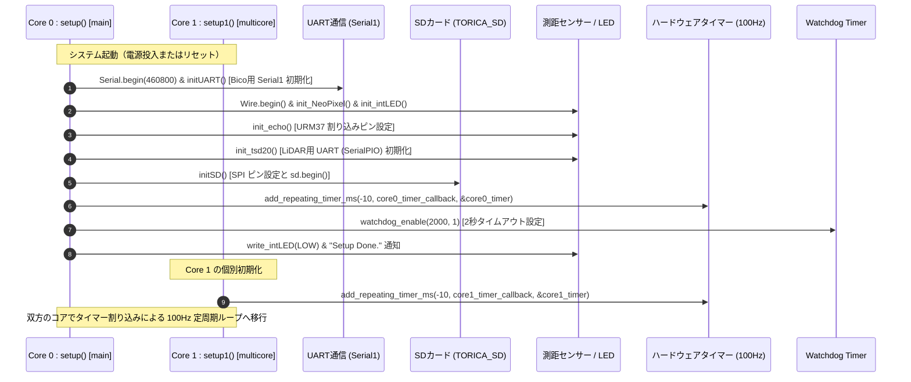
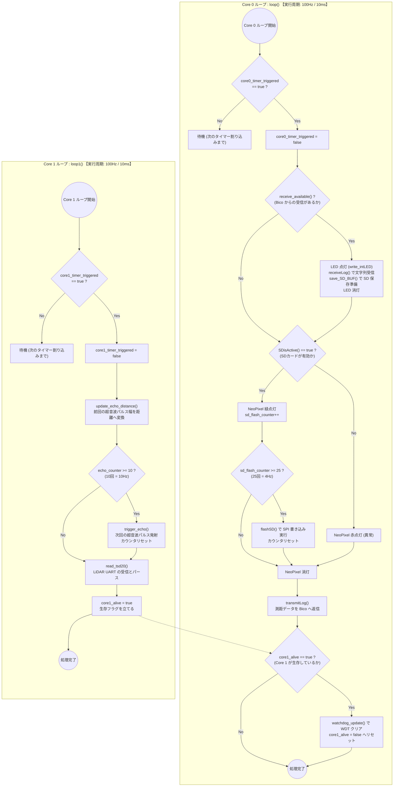

# RP2040 デュアルコア処理・タイマー割り込み＆タスクフロー

`26th_Underside` プログラムでは、RP2040 の 2 つの CPU コア（Core 0 と Core 1）に処理を完全に分離し、それぞれに対して独立した 100Hz（周期 10ms）のハードウェアタイマー割り込みを設定して定周期処理を行っています。

---

## 1. 初期化およびマルチコア起動シーケンス (`setup()` / `setup1()`)

システム起動時、Core 0 が最初に `setup()` を実行し、UART（Bico通信用）や SD カード用 SPI、測距センサーのピンアサイン設定、LED、CSV ヘッダーの書き込み初期化などを行った後、ハードウェアタイマーおよび Watchdog を有効化します。Core 1 は `pico/multicore` によって自動起動され、並列でタイマー設定を行います。

---

## 2. Core 0 vs Core 1 のタスクループフローチャート

タイマーコールバック関数 (`core0_timer_callback` / `core1_timer_callback`) が 10ms 毎にフラグ (`core0_timer_triggered` / `core1_timer_triggered`) を `true` にすることで、メインループ (`loop()` / `loop1()`) 内の定周期処理が起動します。

---

## 3. タスク分離の意図と Watchdog 機構

### 処理ブロック（SD 遅延）の回避
SD カードへの `flashSD()` 処理（SPI 通信）は、ブロック書き込みのタイミング等により突発的に数十ミリ秒の遅延（ブロッキング）を発生させるリスクがあります。
これを測距センサーの割り込みやパルス生成 (`trigger_echo`) と同じコアで行うと、**超音波のエコーパルス幅計測が狂ったり、TSD20 の UART バッファが溢れたり** します。
Core 0 を「通信と SD 記録」、Core 1 を「測距センサー専任」に分けることで、SD 書き込みが遅延しても高度計測の精度に全く影響が出ない堅牢なアーキテクチャを実現しています。

### デュアルコアクロス Watchdog 監視機構
Bico 基板と同様に、**「Core 0 と Core 1 がお互いを監視して初めて WDT がリフレッシュされる」** 相互監視を行っています。
- Core 1 が 1 ループ実行するたびに `core1_alive = true` をセットします。
- Core 0 は自ループの最後で `core1_alive == true` を確認できた場合のみ `watchdog_update()` を実行して WDT カウンタを巻き戻し、`core1_alive = false` にリセットします。
- これにより、SD 書き込みが完全にフリーズしたり、UART 割り込みがスタックしたりした場合、**2 秒経過すると自動的にシステム全体をリセット・再起動** させます。
