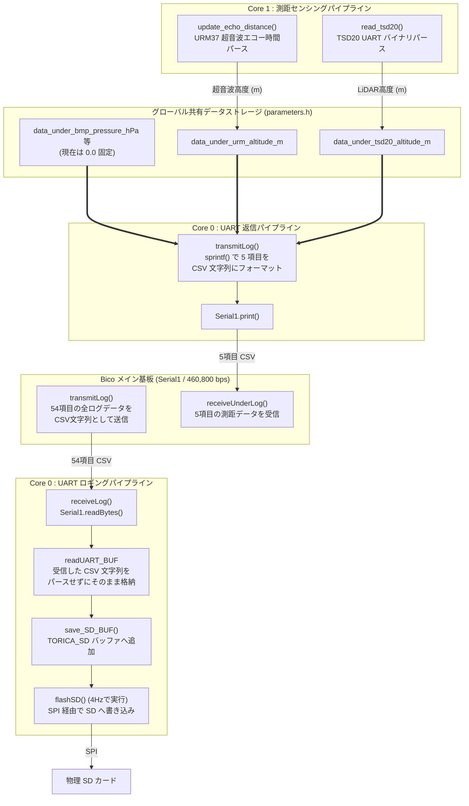

# データ送受信・SD保存・測距パイプラインフロー

`26th_Underside` では、メインコントローラーである Bico から送られてくる大量の全ログデータを受信して SD カードへ書き込む **「ロギングパイプライン」** と、自らが測距した対地高度データを Bico へ送り出す **「センシング返信パイプライン」** の 2 つが交差することなく動作しています。

---

## 1. データ送受信およびSDロギングのパイプラインフローチャート



---

## 2. ダイレクト SD ロギングの意図（パースの省略）

Under 基板が Bico から受信するデータは、54 項目の `float` や `uint32_t` などが含まれた長大な CSV 文字列です。
これをわざわざ `strtok` や `atof` を用いて数値型へパース（解析）することは、以下の理由から **行っていません**。

1. **処理負荷の軽減**: 54 項目もの浮動小数点を文字列から変換する処理は非常に重く、100Hz の制御ループを圧迫し、SD カードのフラッシュタイミングを逃す原因になります。
2. **目的の単一化**: Under 基板にとって Bico のログ（姿勢角や GPS など）は計算に必要なく、ただ「フライトログとして SD カードにバックアップ保存すること」だけが目的です。
3. **バッファオーバーフローの防止**: `receiveLog()` は受信したバイト列をそのまま 512 バイトの `readUART_BUF` に格納し、`save_SD_BUF()` を経由して `TORICA_SD` に丸投げします。これにより、極めて軽量かつ堅牢にログを退避させています。

---

## 3. Bico へ返信する 5 項目データフォーマット (`transmitLog()`)

Under 基板が測距したデータは、Core 0 の `transmitLog()` によって 5 つのカンマ区切り CSV 文字列に成形され、Bico へ返送されます。

```c
sprintf(trans_buff, "%.2f,%.2f,%.2f,%.2f,%.2f\n", 
    data_under_bmp_pressure_hPa, 
    data_under_bmp_temperature_deg, 
    data_under_bmp_altitude_m, 
    data_under_urm_altitude_m, 
    data_under_tsd20_altitude_m
);
```

| インデックス | 変数名 | データ内容・単位 | 現状の動作 |
| :---: | :--- | :--- | :--- |
| **0** | `data_under_bmp_pressure_hPa` | 機体下 BMP390 気圧 (hPa) | `0.00` (未取得) |
| **1** | `data_under_bmp_temperature_deg` | 機体下 BMP390 温度 (℃) | `0.00` (未取得) |
| **2** | `data_under_bmp_altitude_m` | 機体下 BMP390 気圧高度 (m) | `0.00` (未取得) |
| **3** | `data_under_urm_altitude_m` | **URM37 超音波高度 (m)** | 4cm〜8m の範囲で計測、範囲外・エラーは `10.0` |
| **4** | `data_under_tsd20_altitude_m` | **TSD20 LiDAR 高度 (m)** | 計測値、チェックサムエラーや測定限界は `-1.0` |

※現在、BMP390 に関する読み取り関数 (`read_bmp_under()`) は負荷やハードウェア構成の都合でコメントアウトされているため、前半の 3 項目は常に `0.00` となり、実質的に後半の測距 2 項目が Bico 側での離陸判定に用いられます。
