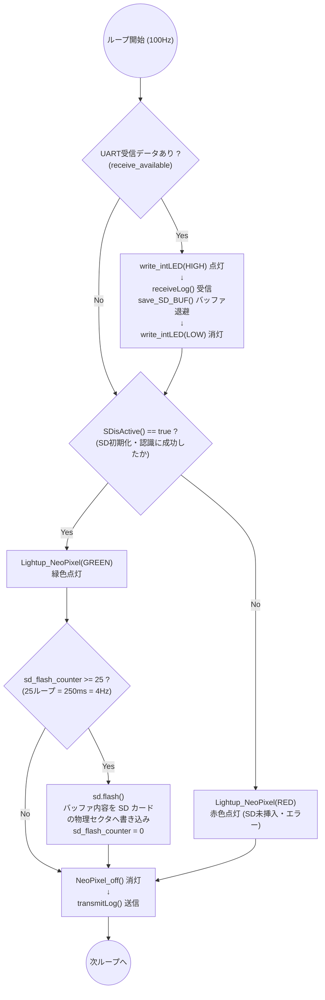
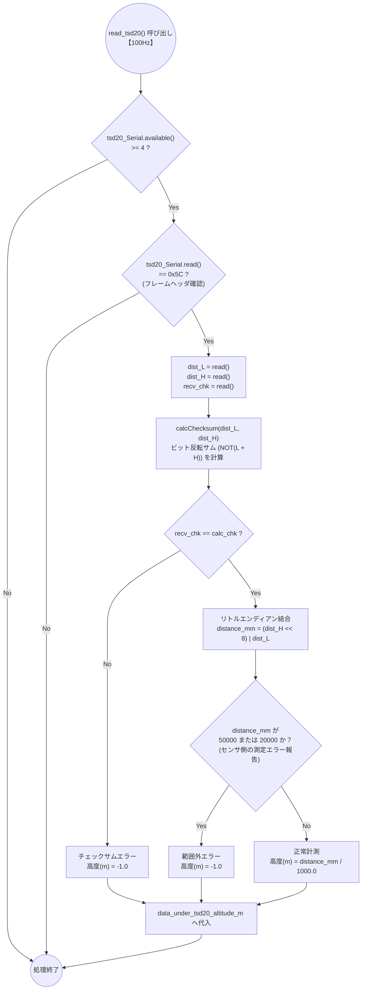

# SDロギング・LEDインジケータ・高度計測仕様

`26th_Underside` の運用において、確実にデータが保存されているか、またセンサーが正常に動作しているかを確認することは極めて重要です。本ドキュメントでは、NeoPixel を用いた直感的な状態通知の仕組みと、超音波センサー・LiDAR からの正確な高度計測ロジックを図解します。

---

## 1. SD ロギングタイミングと NeoPixel 状態インジケータ

Under 基板の `loop()` (Core 0) では、SD カードの書き込み状態を 3 色の NeoPixel で常時通知しています。
また、通信が行われるたびに基板内蔵の通常 LED (`intLED`) が点滅するため、地上で「通信」と「記録」の双方が生きているか一目で判別可能です。



### なぜ 4Hz で SD に書き込むのか
毎回（100Hz）`flashSD()` を実行すると、SPI 通信のオーバーヘッドや SD カード内部のウェアレベリング処理によって書き込み遅延が発生しやすくなります。250ms ごと（4Hz）にまとめてフラッシュすることで、マイコンの負荷を下げつつ、万が一の電源断時にも直前までのデータを安全に保持できるバランスを取っています。

---

## 2. URM37 超音波高度センサー計測回路 (`update_echo_distance()`)

URM37 超音波センサーは、パルス (`trigger_echo`) を送ったあと、エコーが戻ってくるまでのピンの LOW 時間（パルス幅）に比例して距離が導出されます。ブロッキング関数である `pulseIn()` を使用せず、**ハードウェア `CHANGE` 割り込み** を用いることで、RP2040 のメイン処理を止めることなく計測を実現しています。

```mermaid
flowchart LR
    subgraph Trigger ["10Hz 定期トリガー (Core 1)"]
        Trig_Start["trigger_echo()<br>10ループ (100ms) に1回"] --> Pin_Low["URTRIG ピンを LOW に落とす<br>(50μs 待機)"]
        Pin_Low --> Pin_High["URTRIG ピンを HIGH に戻す<br>↓<br>echo_data_ready = false<br>waiting_for_echo = true"]
    end

    subgraph ISR ["ハードウェア割り込み (echo_isr)"]
        Echo_Pin{"URECHO ピン<br>CHANGE 検知"}
        Echo_Pin -->|立ち下がり (LOW)| Rec_Start["echo_start_time = micros()"]
        Echo_Pin -->|立ち上がり (HIGH)| Calc_Diff["echo_low_time = micros() - start_time<br>echo_data_ready = true"]
    end

    subgraph Parser ["パルス幅 -> 高度変換 (Core 1)"]
        Check_Ready{"echo_data_ready<br>== true ?"} -->|Yes| Check_Range{"low_time が<br>200 〜 40,000μs の範囲内か ?<br>(4cm 〜 8m)"}
        
        Check_Range -->|Yes| Calc_Alt["距離(cm) = low_time / 50<br>高度(m) = 距離 / 100"]
        Check_Range -->|No (近すぎ・遠すぎ)| Alt_10["エラー扱い<br>高度(m) = 10.0"]

        Calc_Alt --> Save_URM["data_under_urm_altitude_m へ代入"]
        Alt_10 --> Save_URM
        
        Check_Ready -->|No| Check_Timeout{"waiting_for_echo == true かつ<br>トリガーから 60ms 以上経過 ?"}
        Check_Timeout -->|Yes (タイムアウト)| Alt_10_TO["エラー扱い<br>高度(m) = 10.0"] --> Save_URM
    end

    Trigger -.- ISR
    ISR -.- Parser
```

---

## 3. TSD20 LiDAR UART パース回路 (`read_tsd20()`)

TSD20 は、UART (460,800 bps) 経由で 4 バイトのバイナリフレームを連続送信してきます。
Core 1 は `SerialPIO` を用いてこのデータを受け取り、フレームヘッダ (`0x5C`) とチェックサムを照合して距離を抽出します。


