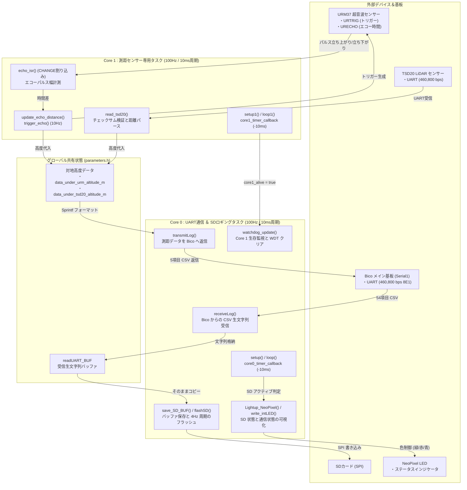
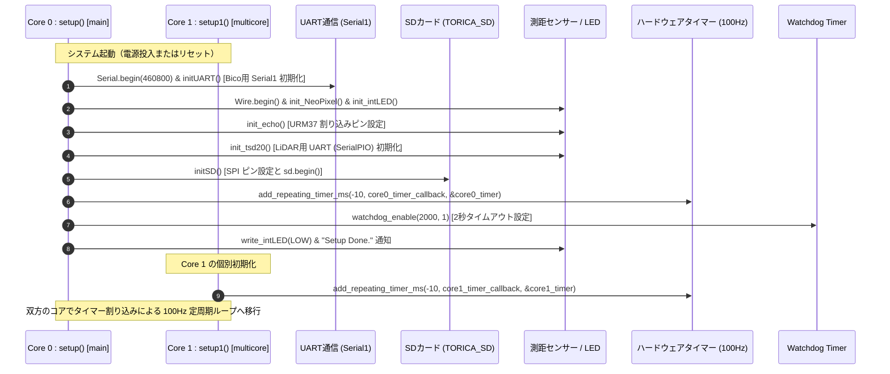
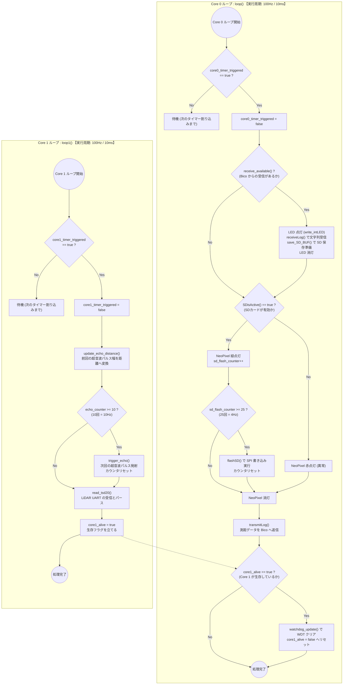
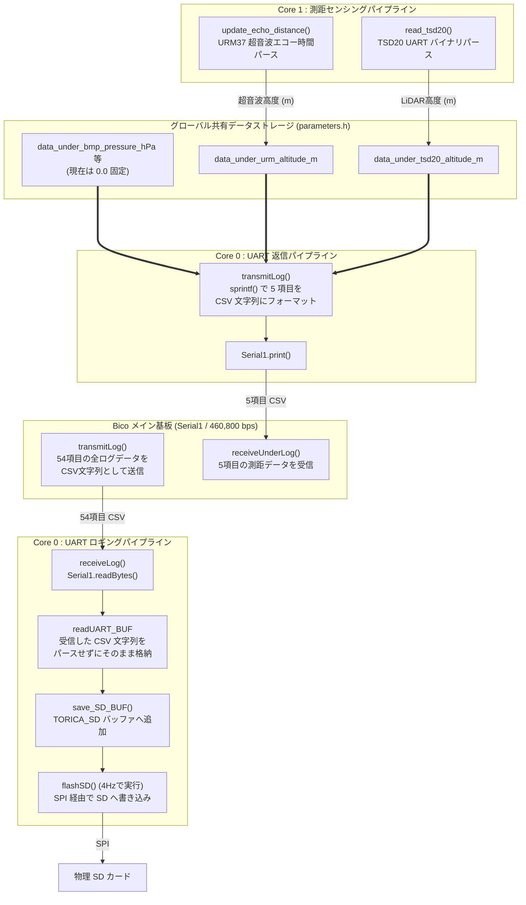
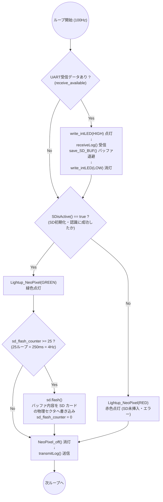
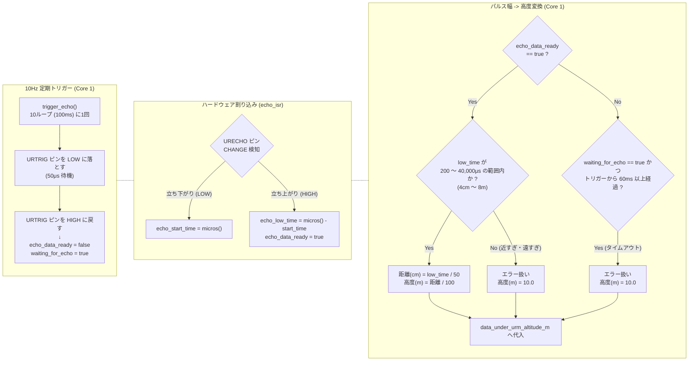
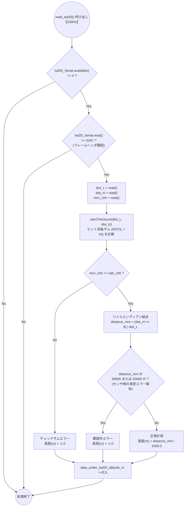
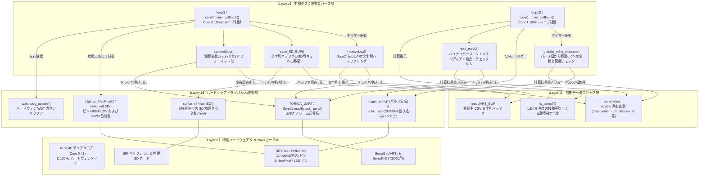

# draw.io 貼り付け専用 Mermaid スニペット集 (`26th_Underside` / RP2040)

## 1. システム全体アーキテクチャ図 (`README.md`)

## 2. インクルード関係グラフ (`01_file_relationships.md`)

```mermaid
flowchart TD
    subgraph Core_Headers ["共通基盤層 (ヘッダーと設定)"]
        Config_H["Underside_config.h<br>(ピン配置・ペリフェラル設定)"]
        Params_H["parameters.h<br>(volatile 変数・LogData 構造体宣言)"]
    end

    subgraph Hardware_Drivers ["ハードウェア＆通信ドライバ層"]
        SD_H["SD_Under.h"]
        SD_C["SD_Under.cpp"]
        UART_H["UARTHelper_Under.h"]
        UART_C["UARTHelper_Under.cpp"]
        URM_H["URM37.h"]
        URM_C["URM37.cpp"]
        TSD_H["tsd20.h"]
        TSD_C["tsd20.cpp"]
        Neo_H["NeoPixel.h"]
        Neo_C["NeoPixel.cpp"]
        LED_H["LED.h"]
        LED_C["LED.cpp"]
    end

    subgraph Logic_Modules ["物理計算モジュール層"]
        Alt_H["calculate_altitude.h"]
        Alt_C["calculate_altitude.cpp"]
    end

    subgraph Main_Entry ["メインエントリポイント"]
        Main_INO["26th_Underside.ino"]
    end

    SD_C --> SD_H
    SD_C --> Config_H
    SD_C --> Params_H

    UART_C --> UART_H
    UART_C --> SD_H
    UART_C --> Params_H

    URM_C --> URM_H
    URM_C --> Config_H
    URM_C --> Params_H

    TSD_C --> TSD_H
    TSD_C --> Config_H
    TSD_C --> Params_H

    Neo_C --> Neo_H
    LED_C --> LED_H

    Alt_C --> Alt_H
    Alt_C --> Params_H

    Main_INO --> Params_H
    Main_INO --> Config_H
    Main_INO --> UART_H
    Main_INO --> SD_H
    Main_INO --> URM_H
    Main_INO --> TSD_H
    Main_INO --> Neo_H
    Main_INO --> LED_H
    Main_INO --> Alt_H
```

## 3. 初期化シーケンス図 (`02_core_tasks_flowchart.md`)

## 4. Core 0 vs Core 1 タスクループフローチャート (`02_core_tasks_flowchart.md`)

## 5. データ送受信・SD保存・測距パイプラインフロー (`03_data_pipeline_flowchart.md`)

## 6. SDロギングタイミングと NeoPixel 状態インジケータ (`04_sd_and_sensors_flowchart.md`)

## 7. URM37 超音波高度センサー計測回路 (`04_sd_and_sensors_flowchart.md`)

## 8. TSD20 LiDAR UART パース回路 (`04_sd_and_sensors_flowchart.md`)

## 9. 4層レイヤー構造・関数ヒエラルキー (`06_layer_hierarchy_flowchart.md`)

