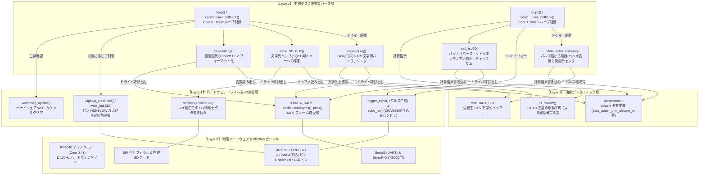

# ソフトウェアレイヤー構造・関数ヒエラルキーと処理関係

本ドキュメントでは、`26th_Underside` (RP2040) プロジェクトにおける各関数が「物理デバイスやペリフェラルに近い低レイヤー」なのか、「タスクループや通信パースを行う中間レイヤー」なのか、「変数の保存と判定を行う高レイヤー」なのかを分類した階層（ヒエラルキー）図と、その依存関係を解説します。

---

## 1. 4層レイヤー階層（ヒエラルキー）の定義と役割

| 階層 | レイヤー名 | 役割・責務 | 該当する主なモジュール・関数・変数 |
| :---: | :--- | :--- | :--- |
| **Layer 3** | **抽象データロジック層** *(Abstracted Data Layer)* | 計測された生データを保存し、他のすべてのタスクから参照・更新される変数群と、閾値に基づくシンプルな判定ロジック | `is_takeoff()`, `struct LogData`, 共有バッファ `readUART_BUF`, `data_under_urm_altitude_m` 等の `volatile` 変数 |
| **Layer 2** | **中間タスク制御＆パース層** *(Task Wrapper / Parser)* | 100Hz 割り込みコールバックによるタスクループの実行、データバッファの移動、文字列フォーマット（`sprintf`）、およびチェックサムや範囲検証 | `loop()`, `loop1()`, `receiveLog()`, `transmitLog()`, `save_SD_BUF()`, `update_echo_distance()`, `read_tsd20()` |
| **Layer 1** | **ハードウェアドライバ＆I/O制御層** *(Hardware Driver Layer)* | SPI / UART / GPIO ペリフェラルの初期化、SDへの物理フラッシュ、超音波パルスのトリガー、LED色制御、およびハードウェア割り込みハンドラ | `initUART()`, `initSD()`, `flashSD()`, `trigger_echo()`, `echo_isr()`, `Lightup_NeoPixel()`, `write_intLED()`, `watchdog_update()` |
| **Layer 0** | **物理ハードウェア＆RP2040 カーネルプリミティブ** *(Physical Hardware / Kernel)* | デュアルコア CPU、物理ピン状態、ハードウェア割り込み機構、ハードウェアタイマー、SPI バス、UART ペリフェラル等の低レイヤーリソース | RP2040 (`Core 0` / `Core 1`), SPI (`SD_CS`, `MOSI`, `MISO`, `SCK`), GPIO/NeoPixel ピン, `Serial1`, `SerialPIO`, `CHANGE` 割り込み, `add_repeating_timer_ms` |

---

## 2. ソフトウェアレイヤーヒエラルキー＆統合呼び出し関係図

以下の図は、上段から下段に向かって**抽象度の高さ（上：高レイヤー・抽象ロジック ⇔ 下：低レイヤー・物理I/O）** を配置し、データの流れと呼び出しの方向を矢印で示しています。

---

## 3. レイヤー分離の意図と特徴（Under基板特有の設計）

Bico 基板とは異なり、Under 基板では「高度な物理計算（気圧高度や対気速度など）」が存在しません。そのため Layer 3 が非常に薄く、実質的に「ただの変数の置き場所」となっています。

一方で、**Layer 1（ハードウェアドライバ）から Layer 2（パース層）へのデータの流れが分厚い** のが特徴です。
- URM37 では、Layer 0 のピン変化が Layer 1 の割り込みハンドラ (`echo_isr`) を即座に叩き、その記録時間を Layer 2 (`update_echo_distance`) が安全なタイミングで吸い出して距離に変換します。
- TSD20 では、Layer 0/1 の UART 受信バッファに溜まったバイナリを Layer 2 (`read_tsd20`) がバイト単位で取り出し、チェックサム検証というパズルを解いて初めて Layer 3 のグローバル変数へと昇格させます。

このように、ノイズの多い物理世界（Layer 0/1）のデータを、いかに綺麗に浄化・整形してグローバル空間（Layer 3）へ送り届けるかが、Under 基板のソフトウェアにおける最大の関心事となっています。
