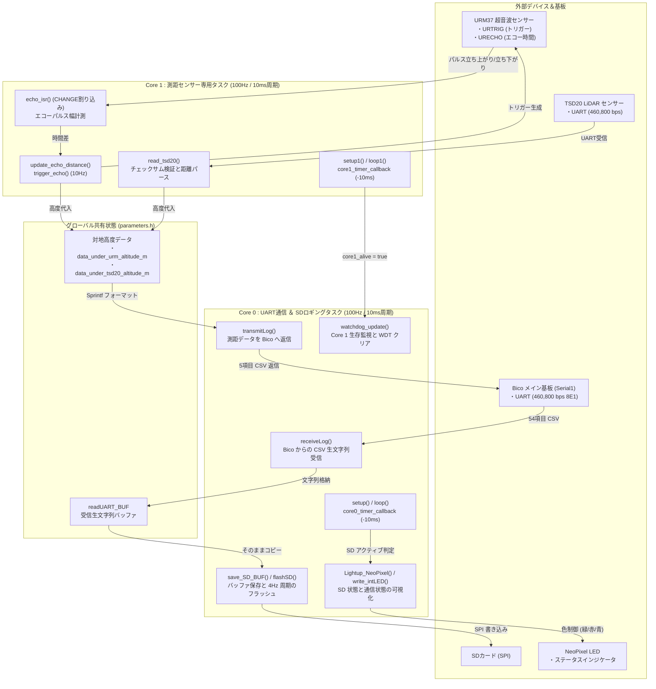

# 26th_Underside (機体下電装 / RP2040) ソフトウェア仕様書

本 `docs` ディレクトリには、鳥人間コンテスト26代機体の機体下電装（Under基板）を担う **`26th_Underside` (デュアルコア RP2040 / Raspberry Pi Pico)** のファイル構成・マルチコア同期・SDロギング・測距センサ制御仕様を網羅した仕様書と、draw.io 貼り付け可能な Mermaid 図解を収録しています。

---

## 1. ドキュメント構成（目次）

本ドキュメントは以下の6部構成（＋draw.io用コード集の全7ファイル）となっています。各Markdownファイル内で詳細なMermaidチャートと技術解説を記述しています。

| ファイル名 | タイトル | 概要 |
| :--- | :--- | :--- |
| **[01_file_relationships.md](01_file_relationships.md)** | **ファイル構成とインクルード依存グラフ** | 各 `.ino`, `.h`, `.cpp` ファイルの役割、インクルード依存関係、およびグローバル変数の共有設計 |
| **[02_core_tasks_flowchart.md](02_core_tasks_flowchart.md)** | **RP2040 デュアルコア処理＆同期フロー** | Core 0（SD書き込み＆UART送受信）と Core 1（高度センサー計測）の 100Hz タイマー割り込みと Watchdog 監視機構 |
| **[03_data_pipeline_flowchart.md](03_data_pipeline_flowchart.md)** | **データ受信・SD保存・送信パイプライン** | Bico からの受信生ログの SD ダイレクト保存と、自基板の URM/TSD20 測距データの Bico への返信フロー |
| **[04_sd_and_sensors_flowchart.md](04_sd_and_sensors_flowchart.md)** | **SDロギング・LED表示・高度計測仕様** | SD カードのフラッシュタイミングと NeoPixel 状態表示、および URM37 (超音波) / TSD20 (LiDAR) の処理回路図 |
| **[06_layer_hierarchy_flowchart.md](06_layer_hierarchy_flowchart.md)** | **4層レイヤー構造＆関数ヒエラルキー** | 全関数を「物理I/O・ハードウェア・タスク制御・抽象ロジック」の4階層へ分類し、処理の依存方向を明示した設計書 |
| **[05_drawio_mermaid_snippets.md](05_drawio_mermaid_snippets.md)** | **draw.io用貼り付けコード＆インポート手順** | draw.io (app.diagrams.net) の Mermaid インポート機能に完全対応した、純粋な図解コード集（全7図解） |

---

## 2. システム全体の概要（全体アーキテクチャ）

`26th_Underside` は、メインコントローラーである Bico 基板と対になる「機体下部のサブシステム」です。
主な役割は以下の 2 点に集約されます。
1. **メインログの SD バックアップ保存**: Bico から 460,800 bps で送られてくる全 54 項目のフライトログ CSV 文字列を受信し、パースすることなくそのまま SD カード（`TORICA_SD`）へ記録します。
2. **対地高度の計測**: 超音波センサー (URM37) と LiDAR (TSD20) を用いて地面までの距離をリアルタイム計測し、Bico へ返信します。

RP2040 のマルチコア機能を生かし、**「Core 0：SD カード書き込みと UART 通信タスク」** と **「Core 1：測距センサーのハードウェア割り込み・シリアルパース専用タスク」** を分離することで、SD カードの書き込みブロック（遅延）が測距タイミングや UART 受信の取りこぼしに影響を与えない堅牢な設計となっています。

---

## 3. コア別タスクと割り込み処理のまとめ

| コア | エントリ関数 | 動作周期 | タスクの責務・概要 |
| :---: | :--- | :---: | :--- |
| **Core 0** | `setup()` `loop()` | **100Hz (10ms)** `core0_timer` | 1. **UART 受信と SD ロギング**: Bico からの 54 項目テレメトリを `receiveLog()` で受け取り、パースせずにそのまま `save_SD_BUF()` で SD バッファへ直行させ、4Hz で `flashSD()` を実行。 2. **UART 送信**: 共有変数にある URM/TSD20 の高度データを 5 項目カンマ区切りで Bico へ送信。 3. **ステータス表示・監視**: SD のアクティブ状態に応じて NeoPixel を点灯（緑/赤）させ、Core 1 が生存していれば Watchdog を更新。 |
| **Core 1** | `setup1()` `loop1()` | **100Hz (10ms)** `core1_timer` | 1. **URM37 制御**: `trigger_echo()` を 10Hz で発火し、ハードウェア割り込み (`echo_isr`) で得たパルス時間を元に超音波高度を計算 (`update_echo_distance`)。 2. **TSD20 LiDAR パース**: 460.8kbps の専用 UART から送られるバイナリフレームを受信し、チェックサムを検証して LiDAR 高度を算出 (`read_tsd20`)。 3. **生存アピール**: 毎ループ `core1_alive = true` を立てる。 |
